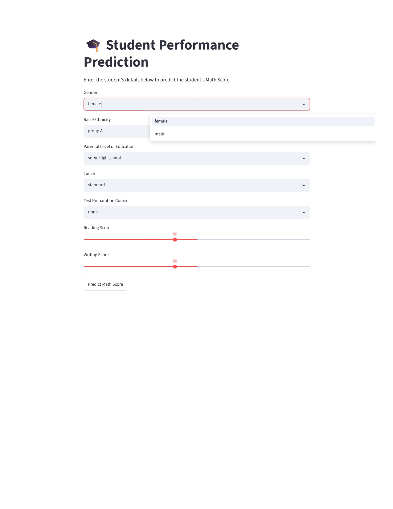
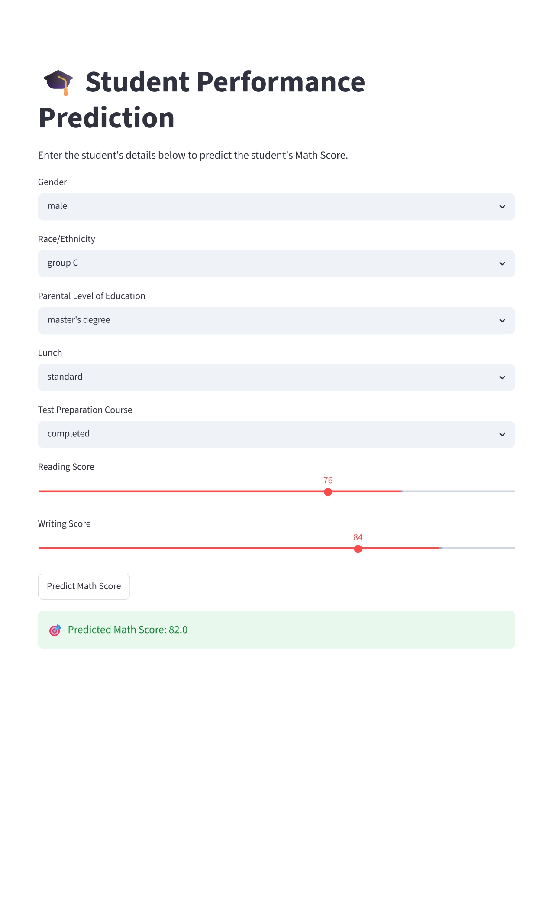

# 🎓 Student Performance Prediction using Machine Learning

## 📖 Project Overview

This project predicts a student's **Math Score** based on demographic and academic information using Machine Learning. It demonstrates the complete Machine Learning workflow, including data preprocessing, exploratory data analysis (EDA), model training, hyperparameter tuning, model evaluation, and deployment using **Streamlit**.

The final application allows users to enter student details through a web interface and instantly receive a predicted Math Score.

---

## ✨ Features

- 📊 Exploratory Data Analysis (EDA)
- 🔄 Data Preprocessing using Scikit-learn Pipelines
- 🤖 Multiple Regression Models
- ⚙️ Hyperparameter Tuning using GridSearchCV
- 📈 Model Evaluation using Multiple Metrics
- 💾 Model Saving using Joblib
- 🌐 Interactive Streamlit Web Application

---

## 📊 Dataset

**Dataset:** Students Performance in Exams

### Target Variable

- Math Score

### Input Features

- Gender
- Race/Ethnicity
- Parental Level of Education
- Lunch
- Test Preparation Course
- Reading Score
- Writing Score

---

## 🛠 Technologies Used

- Python
- Pandas
- NumPy
- Matplotlib
- Scikit-learn
- Streamlit
- Joblib
- Jupyter Notebook
- Git
- GitHub

---

## ⚙️ Machine Learning Workflow

1. Data Loading
2. Exploratory Data Analysis (EDA)
3. Data Cleaning
4. Feature Engineering
5. Feature Encoding
6. Feature Scaling
7. Train-Test Split
8. Model Training
9. Hyperparameter Tuning using GridSearchCV
10. Model Evaluation
11. Model Saving
12. Streamlit Deployment

---

## 📈 Model Comparison

| Model | MAE | RMSE | R² Score |
|------|------:|------:|------:|
| Linear Regression | 4.21 | 5.39 | 0.8804 |
| Decision Tree Regressor | 6.67 | 8.39 | 0.7107 |
| Random Forest Regressor | 4.73 | 6.05 | 0.8496 |
| **Tuned Random Forest** | **3.17** | **4.05** | **0.9326** |

The **Tuned Random Forest Regressor** achieved the best performance after hyperparameter tuning using **GridSearchCV** and was selected as the final model for deployment.

---

## 🏆 Final Model

**Algorithm:** Random Forest Regressor

### Hyperparameter Tuning

Technique Used:

- GridSearchCV
- 5-Fold Cross Validation

### Best Parameters

- n_estimators = 200
- max_depth = 5

### Final Performance

- MAE = **3.17**
- RMSE = **4.05**
- R² Score = **0.9326**

---

## 📂 Project Structure

```text
Student-Performance-Prediction/
│
├── app.py
├── README.md
├── requirements.txt
├── .gitignore
├── LICENSE
│
├── assets/
│   └── screenshots/
│       ├── home.png
│       └── prediction.png
│
├── data/
│   ├── raw/
│   │   └── StudentsPerformance.csv
│   └── processed/
│
├── models/
│   ├── model.pkl
│   └── preprocessor.pkl
│
├── notebooks/
│   └── 01_data_exploration.ipynb
│
└── src/
    ├── __init__.py
    ├── data_preprocessing.py
    ├── evaluate.py
    ├── predict.py
    ├── train.py
    └── utils.py
```

---

## 📸 Application Preview

### Streamlit Application



### Prediction Example



---

## 🚀 Installation

### Clone the Repository

```bash
git clone https://github.com/rudragupta-27/Student-Performance-Prediction.git
```

### Navigate to the Project Folder

```bash
cd Student-Performance-Prediction
```

### Install Dependencies

```bash
pip install -r requirements.txt
```

### Run the Streamlit Application

```bash
streamlit run app.py
```

---

## 💻 How to Use

1. Open the Streamlit application.
2. Enter the student's details.
3. Click **Predict Math Score**.
4. View the predicted Math Score.

---

## 🔮 Future Improvements

- Add more regression algorithms (XGBoost, LightGBM, CatBoost)
- Feature Selection
- SHAP Explainability
- Docker Deployment
- Cloud Deployment (AWS/Azure/GCP)
- CI/CD Pipeline
- Automatic Model Retraining

---

## 📚 What I Learned

During this project, I learned:

- Exploratory Data Analysis (EDA)
- Data Preprocessing
- Feature Encoding
- Feature Scaling
- Train-Test Split
- Linear Regression
- Decision Tree Regression
- Random Forest Regression
- Hyperparameter Tuning
- GridSearchCV
- Cross Validation
- Model Evaluation
- Model Persistence using Joblib
- Streamlit Deployment
- Git & GitHub
- Professional Project Structure

---

## 👨‍💻 Author

**Rudra Gupta**

B.Tech Computer Science (AI & ML)

UPES Dehradun

GitHub:
https://github.com/rudragupta-27

---

## ⭐ If you found this project helpful, consider giving it a star on GitHub!